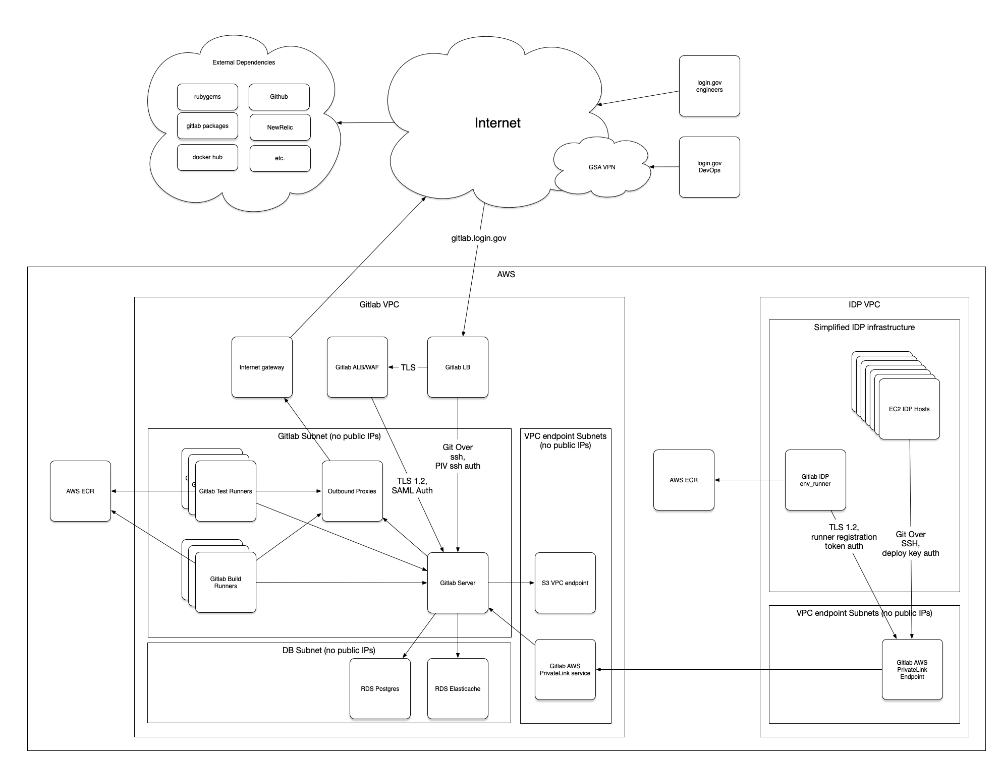
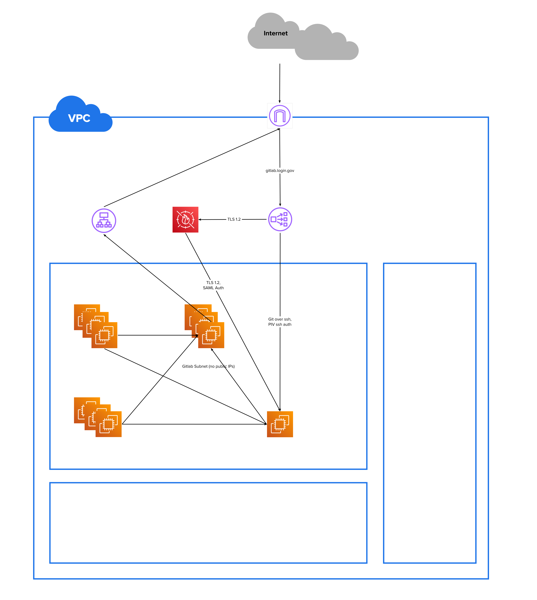
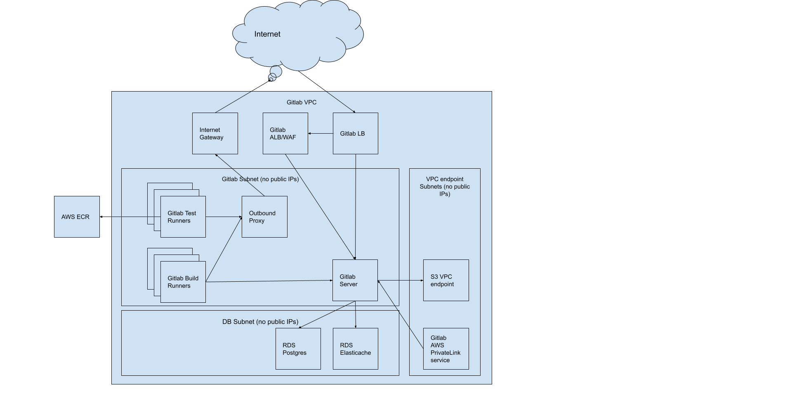
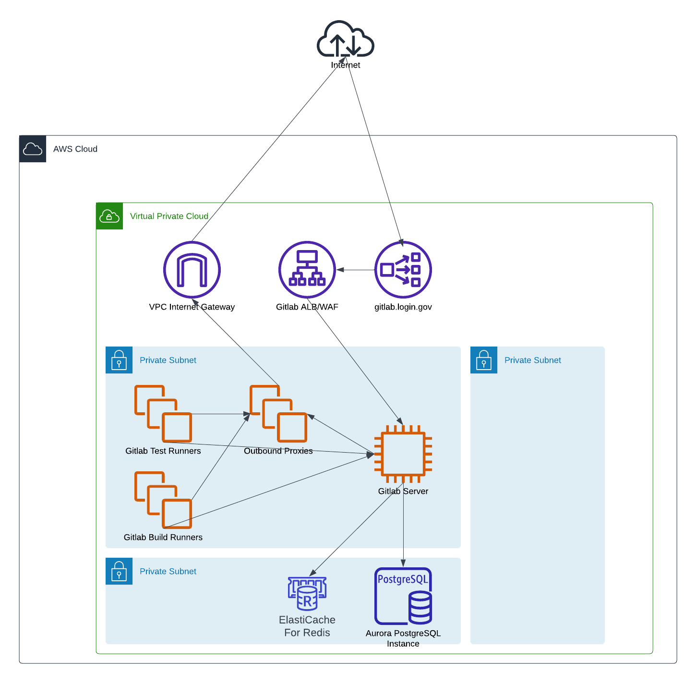

# ADR 8: Diagrams

> Use OmniGraffle for producing diagrams for devops-related documentation

__Status__: proposed

## Context
We need to provide diagrams so that people can understand our systems, both internally
(new employees), and externally (our SSP).  We need a tool that we can all use to create
and publish diagrams.  There are many available, and all have their strengths and weaknesses.

Our requirements are:
* We must be able to procure/run it in the GSA environment
* It must be able to export the image to PNG
* The source data should be able to be stored in git, so we have version control
* It must be able to generate diagrams that are not ugly
* It should be able to use the AWS icon set if we want to

## Decision
We will use OmniGraffle for diagrams.

## Consequences

People who want to edit diagrams will need to have a Mac and request an
OmniGraffle license from GSA IT.  The OmniGraffle document will be stored in
Git, which is a bit ugly because it's binary, but it's not super large.

On the other hand, it will be _very_ easy to create nice looking diagrams.

## Alternatives Considered

Here are some of the options, and their pro/cons:
* *PlantUML:*  Diagram in code.  Great for UML, really not great for networks
  and system diagrams.
* *OmniGraffle:*  SUPER featureful, looks great, easy to use.  Requires
  license and a Mac, AWS icons are out of date unless we get latest version.
  
* *Mural:*  Easy to use, AWS icons available, many people already use it.
  Cannot save document to file to put in git.  Not really meant
  for diagramming, so not super pretty.  
  
* *Google Drawings:*  Simple to use.  Cannot save document to file to put in git.
  Not super featureful, like you cannot label lines.  Looks OK, no AWS icons.
  
* *Minigrammer:*  Code is nice and python-y, pretty icons.  TERRIBLE layout.
  
* *Structurizr:*  Looks pretty, is not authorized.
* *Lucid Charts:*  This looks pretty nice.  Their support for AWS icons is really
  good.  It is not authorized in GEAR, but they are in-process for getting an
  agency ATO.  Seems to be the best option for online systems.
  Cannot save document to file to put in git.
  
* *Figma:*  This is nifty, but you cannot connect arrows and have them move
  around when the objects move around.  Cannot save document to file to put in git.
* *Visio:*  This only runs on windows, which basically nobody has in our group.
