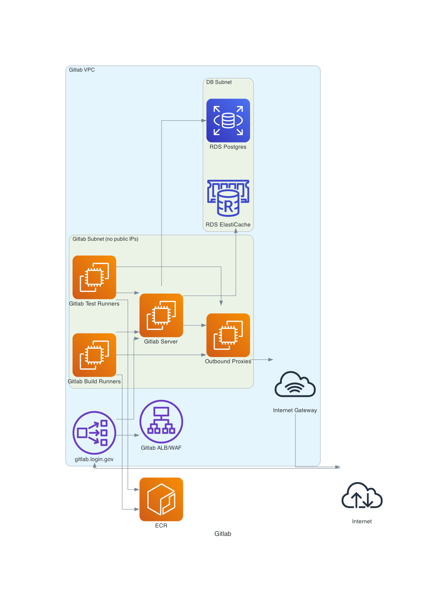

# ADR 8: Diagrams

> Use OmniGraffle for producing diagrams for platform-related documentation with
  PlantUML as an alternate for sequence diagrams.

__Status__: proposed

## Context
We need to provide diagrams so that people can understand our systems, both internally
(new employees), and externally (our SSP).  We need a tool that we can all use to create
and publish diagrams.  There are many available, and all have their strengths and weaknesses.

Our requirements are:
* We must be able to procure/run it in the GSA environment
* It must be able to export the image to PNG
* The source data should be able to be stored in git, so we have version control
* It must be able to generate diagrams that are not ugly
* It should be able to use the AWS icon set if we want to

## Decision

We will use OmniGraffle by default for diagrams including architectural, network, and data flow diagrams.

Sequence diagrams, ERD, and class diagrams (traditionally the domain of UML) may use PlantUML.

## Consequences

People who want to edit diagrams will need to have a Mac and request an
OmniGraffle license from GSA IT.  The OmniGraffle document will be stored in
Git, which is a bit ugly because it's binary, but it's not super large.

On the other hand, it will be _very_ easy to create nice looking diagrams.

## Alternatives Considered

Here are some of the options, and their pro/cons.

* [OmnirGraffle](#omnigraffle)
* [PlantUML](#plantuml)
* [Mural](#mural)
* [Google Drawings](#google-drawings)
* [Minigrammer](#minigrammer)
* [Structurizr](#structurizr)
* [Lucid Charts](#lucid-charts)
* [Figma](#figma)
* [Visio](#visio)

### OmniGraffle

SUPER featureful, looks great, easy to use.  Requires
license and a Mac, AWS icons are out of date unless we get latest version.

### PlantUML

Open source diagrams in code.  Good for C4, UML, sequence, state, and timing diagrams.
While it ships with the AWS glyph set things tend to get difficult to organize for
any complicated network or architectural diagrams.

 
 plantuml-pivcac-sequence.pu source 

~~~
@startuml
' C4 containers
!include https://raw.githubusercontent.com/adrianvlupu/C4-PlantUML/master/C4_Container.puml

title login.gov - PIV/CAC Authentication

skinparam monochrome true

autonumber

actor "User" as user

participant "Web Browser" as browser

participant "Service Provider" as sp

participant "Identity Provider" as idp

participant "PIV/CAC Microservice" as pivcac

participant "OCSP servers" as ocsp

== Login to Service Provider ==

user --> browser: Click Log In link on Service Provider page
browser --> sp: GET Auth Endpoint
activate sp
sp --> browser: 302 Location: https://secure.login.gov/
deactivate sp
browser --> idp: GET /
activate idp
idp --> browser: 200 - "Sign In"
deactivate idp
browser --> user: Display Page

== Visit PIV/CAC Page ==
user --> browser: Click "Sign in with your government employee ID"
browser --> idp: GET /login/piv_cac
activate idp
idp --> browser: 200 - "Sign in with your PIV or CAC"
deactivate idp
browser --> user: Display Page

user --> user: Insert PIV/CAC

== Authenticate With PIV/CAC ==

user --> browser: Click "Insert your PIV/CAC"
browser --> idp: GET /login/present_piv_cac
activate idp
idp --> browser : 302 Location: https://RANDOM.pivcac.prod.login.gov/?nonce=NONCE
deactivate idp

group TLS Handshake
browser --> pivcac : Client Hello
activate pivcac
pivcac --> browser : Server Hello (including Certificate)
pivcac --> browser : Client Certificate Request

browser --> user : Prompted to select user certificate
activate browser
user --> browser: Selected certificate
browser --> user : Prompted to enter PIN
user --> browser: Entered PIN
deactivate browser

browser --> pivcac: Client certificate
pivcac --> browser: TLS Session Initiated
end

browser --> pivcac : GET /?nonce=NONCE
pivcac --> pivcac: Validates certificate signatures, subject, time
pivcac --> ocsp: Checks for revoked certificates
'skinparam DefaultTextAlignment center {
alt OCSP server responds
    ocsp --> pivcac: Certificate check response
else OCSP server timeout
    pivcac --> pivcac: Check local Certificate Revokation List (CRL)
end
'}

pivcac --> browser: 302 Location: https://secure.login.gov/login/piv_cac?token=PIVCAC_TOKEN
deactivate pivcac

browser --> idp: GET /login/two_factor/piv_cac?token=PIVCAC_TOKEN
activate idp
idp --> pivcac: POST /?token=PIVCAC_TOKEN
activate pivcac
pivcac --> pivcac: Validate PIVCAC_TOKEN
pivcac --> idp: 200 OK
deactivate pivcac
idp --> browser: 302 to Service Provider
deactivate idp

== Complete Log In ==

browser --> sp: GET Authenticated Endpoint
activate sp
sp --> browser: 200 "You are now logged in..."
deactivate sp
browser --> user: Display Page

@enduml
~~~

 Spagett!

 
 plantuml-boundary.pu source 

~~~
@startuml
' C4 containers
!include <C4/C4_Container>
!include <C4/C4_Deployment>

' AWS Icons - https://github.com/awslabs/aws-icons-for-plantuml
!define AWSPuml https://raw.githubusercontent.com/awslabs/aws-icons-for-plantuml/v10.0/dist
!include AWSPuml/AWSC4Integration.puml
!include AWSPuml/AWSCommon.puml
'!include AWSPuml/AWSSimplified.puml
!include AWSPuml/General/all.puml
!include AWSPuml/BusinessApplications/all.puml
!include AWSPuml/Compute/all.puml
!include AWSPuml/Containers/all.puml
!include AWSPuml/Database/all.puml
!include AWSPuml/GroupIcons/all.puml
!include AWSPuml/ManagementGovernance/all.puml
!include AWSPuml/NetworkingContentDelivery/all.puml
!include AWSPuml/SecurityIdentityCompliance/all.puml
!include AWSPuml/Storage/all.puml

' K8s Icons - https://github.com/dcasati/kubernetes-PlantUML
!define KubernetesPuml https://raw.githubusercontent.com/dcasati/kubernetes-PlantUML/master/dist

' global definition
!include KubernetesPuml/kubernetes_Common.puml
!include KubernetesPuml/kubernetes_Context.puml
!include KubernetesPuml/kubernetes_Simplified.puml

' k8s specific components
!include KubernetesPuml/OSS/KubernetesPod.puml
!include KubernetesPuml/OSS/KubernetesRs.puml
!include KubernetesPuml/OSS/KubernetesSvc.puml

skinparam arrow {
    Thickness 2
}

skinparam rectangle<<authorization_boundary>> {
    ' FedRAMP wants a big red box so you can see the boundary FROM SPACE!
    BorderColor red
    BorderThickness 4
}

'LAYOUT_WITH_LEGEND()

'UpdateElementStyle(system, $fgColor = "#ff0000")

title Login.gov ATO Boundary

'Person(personnel, "login.gov Member", "A member of the login.gov project")
Person_Ext(public, "The Public", "End Users\nAuthN with UID + password + MFA")
System_Ext(service_provider, "Relying Parties", "OIDC or SAML Integrated\nPartner Applications")

Boundary(idvendors, "Identity Verification Services") {
    System_Ext(aamva, "AAMVA", "Drivers License Data")
    System_Ext(lexisnexis, "LexisNexis", "Verification of Documents, Addresses, Phone Numbers\nRich Fraud Mitigation")
    System_Ext(usps_gpo, "USPS GPO", "Address Verification Letter Delivery")
    System_Ext(usps_ipp, "USPS In Person Proofing", "In Person Document Verification")
}

Boundary(gsa_soc, "GSA SOC") {
    System_Ext(soc_siem, "SOC SIEM", "ELK Event Aggregation and Analysis")
    System_Ext(soc_prisma, "SOC PrismaCloud", "Cloud Resource and Activity Monitoring")
    System_Ext(soc_fireeye, "SOC FireEye HDX", "Endpoint Detection and Response")
    System_Ext(soc_essecurity, "SOC Elastic Security Agent", "Endpoint Detection and Response")
    System_Ext(soc_bigfix, "SOC BigFix", "System Inventory Collection")
}

rectangle << authorization_boundary >> {
    ' BOUNDARY START - Everything in-boundary should be in this block

    Boundary(aws_us_global, "AWS Global Resources") {
        Route53(login_gov, "login.gov", "Route53 w/DNSSEC", "Public DNS")
        CloudFront(idp_cdn, "static.login.gov", "CloudFront", "IdP CDN")
        WAF(idp_cdn_waf, "L7 Filtering", "WAF")
        SimpleStorageServiceBucket(static_bucket, "Static Assets", "S3")
    }

    Boundary(aws_us_west_2, "AWS us-west-2") {
        Boundary(aws_us_west_2_services, "AWS Regional Services") {
            CloudWatch(cloudwatch, "Logs", "CloudWatch")
            SimpleEmailService(ses, "Outbound SMTP", "SES")
            Pinpoint(pinpoint, "SMS/Voice", "Pinpoint")
            KeyManagementService(kms, "IDP Keymaker", "Mutli-Region KMS", "Symmetric Encryption") {
            }
        }
        VirtualPrivateCloud(app_vpc, "Production Application VPC", "VPC") {
            Boundary(ingress, "Ingress") {
                WAF(idp_waf, "L7 Filtering", "WAF")
                ElasticLoadBalancingApplicationLoadBalancer(idp_lb, "secure.origin.login.gov", "AWS ALB", "L7 Load Balancer\nDualstack IPv4/IPv6")
                ElasticLoadBalancingNetworkLoadBalancer(pivcac_lb, "*.pivcac.prod.login.gov", "AWS NLB", "L4 Load Balancer")
            }

            Boundary(egress, "Egress") {
                ElasticLoadBalancingNetworkLoadBalancer(outbound_proxy, "Outbound Proxy LB", "AWS NLB", "L4 Load Balancer")
                Containers(outbound_proxy_app, "OutboundProxy", "Squid Server", "~3 instances")
            }

            Boundary(app, "Applications") {
                Containers(idp_app, "IDP", "Rails Server", "~100 instances")
                Containers(pivcac_app, "PIVCAC", "Rails Server", "~10 instances")
                Containers(worker_app, "Worker", "Rails Server", "~25 instances")
            }

            Boundary(persistance, "Persistence") {
                ElastiCache(idp_cache, "IDP Cache", "AWS Elasticache", "Session Data")
                RDS(idp_db, "IDP DB", "RDS", "User Data")
                RDS(pivcac_db, "PIVCAC DB", "RDS", "PIV/CAC Data")
                RDS(worker_db, "Worker Job DB", "RDS", "Job Data")
            }
        }
    }

    Boundary(aws_us_east_1, "AWS us-east-1") {

        Boundary(aws_us_east_1_services, "AWS Regional Services") {
            CloudWatch(cloudwatch_use1, "Logs", "CloudWatch")
            Pinpoint(pinpoint_use1, "SMS/Voice", "Pinpoint")
            }
        }
    ' BOUDNARY END
}

idp_cdn -d-> static_bucket : [https w/OAI (tcp/443)]
idp_cdn -d-> idp_lb : [https (tcp/443)]
idp_lb -d-> idp_app : [https (tcp/443)]
idp_lb o..|> idp_waf : Filtering and Inspection
:
idp_app -d-> idp_cache : [redis (tcp/6379)]
idp_app -u-> kms : [https w/IAM (tcp/443)]
idp_app -u-> ses : [https w/IAM (tcp/443)]

pivcac_lb -d-> pivcac_app : [https (tcp/443)]
pivcac_app -d-> pivcac_db : [psql (tcp/5432)]

worker_app -d-> worker_db : [psql (tcp/5432)]
worker_app -u-> outbound_proxy : External Services / RISC events [proxy https (tcp/3128)]

outbound_proxy -r-> outbound_proxy_app : [proxy https (tcp/3128)]

outbound_proxy_app -u---> lexisnexis : [https (tcp/443)]
outbound_proxy_app -u---> aamva : [https (tcp/443)]
outbound_proxy_app -u---> usps_gpo : [sftp (tcp/22)]

outbound_proxy_app -> pinpoint : [https (tcp/443)]
outbound_proxy_app -> pinpoint_use1 : [https (tcp/443)]

cloudwatch -u---> soc_siem : Log Shipping via AWS Kineses
cloudwatch_use1 -u---> soc_siem : Log Shipping via AWS Kinesis

public -d---> idp_cdn : Authenticate\nwith\nsecure.login.gov\n[https (tcp/443)]
public -d---> pivcac_lb : MFA with PIV or CAC\n[https w/client auth (tcp/443)]

ses -u---> public : Receive Email\n[smtp (tcp/25)]

pinpoint -u---> public : Receive OTP, verification code, hybrid link\nSMS or Voice

service_provider -d---> idp_cdn : OIDC token and userinfo\n[https (tcp/443)]

outbound_proxy -u---> service_provider : RISC events\n[https (tcp/443)]

idp_app -> pivcac_lb : PIVCAC token validation\n[https (tcp/443)]

note as Notes
    All connections depicted are encrypted with TLS 1.2 unless otherwise noted
    Greyed out items only present while performing Disaster Recovery
    CI/CD, operator access, observability, and analytics capabilities are not shown
end note

legend
    |= Color |= Type |= Description |
    | <size:11><back:#Red>Mary           </back></size>|    <color:Red><$osa_user_green_developer*.4></color> | Mary details... This is a stdlib sprite |
    | <size:11><back:#DarkGreen>Ivan           </back></size>|    <color:DarkGreen><$osa_user_green_operations*.4></color> | Ivan details... |
    | <size:11><back:#Orange>Bob           </back></size>|    <color:Orange><$osa_user_green_business_manager*.4></color> | Bob details... |
    | <size:11><back:#Purple>Box           </back></size>|    <color:Purple><&box></color> | A Box. This is an openiconic sprite |
endlegend

'SHOW_LEGEND()

@enduml

~~~

### Mural

Easy to use, AWS icons available, many people already use it.
Cannot save document to file to put in git.  Not really meant
for diagramming, so not super pretty.

### Google Drawings

Simple to use.  Cannot save document to file to put in git.
Not super featureful, like you cannot label lines.  Looks OK, no AWS icons.

### Minigrammer

Code is nice and python-y, pretty icons.  TERRIBLE layout.

### Structurizr

Looks pretty with a number of export formats including PlantUML.  Well suited for C4
diagrams.  Service is not authorized and self-hosted version seems to be unready.

### Lucid Charts

Pretty output and easy to use cloud based tool.  Their support for AWS icons is really
good.  It is not authorized in GEAR, but they are in-process for getting a [FedRAMP Moderate Agency ATO](https://marketplace.fedramp.gov/#!/product/lucid-for-government?sort=productName&productNameSearch=lucid).
Seems to be the best option for online systems.

Cannot save source document to file to put in git.

### Figma

This is nifty, but you cannot connect arrows and have them move
around when the objects move around.  Cannot save source document to file to put in git.

### Visio

One of the OGs.  This only runs on Windows, which basically nobody has in our group.
