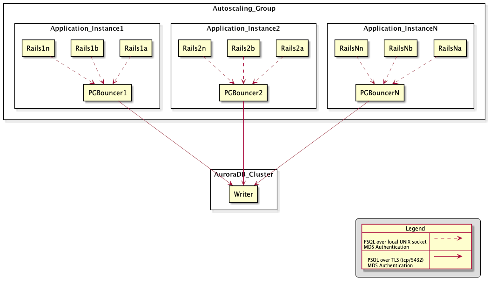

---
# Architecture Decision Record 9: Database Connection Pooling

> We will reduce connection contention for primary database writer instance
> using PGBouncer running per-application instance for connection pooling

__Status__: accepted

## Context

Load testing in 2023 uncovered a tipping point around 50,000 authentications/second
with over 150 connected instances and the largest available AuroraDB PostgreSQL
instance size of `db.r6i.32xlarge`.  Around this point there were about 23,000
active database connections.  This is with our existing per-process pooling.
Performance Insights revealed that COMMIT
(transaction completions) showed a high amount of time spent in `IPC:ProcArrayGroupUpdate`.

Investigation showed that we simply had too many clients trying to COMMIT at once
resulting in contention updating the shared process array.  There are two ways
to reduce this contention:

* Reduce overall COMMITs by combining multiple queries into single transactions
* Reduce connections thereby limiting the number of outstanding simultaneous
  transactions that are being processed

## Decision

We will use PGBouncer as our connection pooler to reduce total connections.

PGBouncer will run on each application and worker instance and pool all connections
to the writer PostgreSQL instance.  Tuning can be used to keep total connections
and contention to manageable level, well under the ~20,000 connection tipping
point observed with the IdP application under stress.

PGBouncer is configured to:
* Use a UNIX socket for client connections
* Require authentication from the client
* Establish validated TLS connections with the PostgreSQL server
* Use `transaction` mode (*requiring disabling prepared statements and advisory
  locks in Rails ActiveRecord). GoodJob relies on advisory locks, so alternative
  strategies will have to be considered if the worker database needs to reduce the
  number of connections.
* Log to the `ENV_/var/log/postgresql/pgbouncer.log` CloudWatch Logs group for
  troubleshooting and potential telemetry of pooler usage.

PGBouncer is automatically configured based on `application.yml` using this
Chef recipe: https://github.com/18F/identity-devops/blob/main/kitchen/cookbooks/login_dot_gov/recipes/pgbouncer_autoconfig.rb

 
 img source 

~~~
@startuml
skinparam BackgroundColor transparent
skinparam componentStyle rectangle

component Autoscaling_Group {
  component Application_Instance1 {
    component Rails1a
    component Rails1b
    Component Rails1n
    component PGBouncer1
  }
  component Application_Instance2 {
    component Rails2a
    component Rails2b
    Component Rails2n
    component PGBouncer2
  }
  component Application_InstanceN {
    component RailsNa
    component RailsNb
    Component RailsNn
    component PGBouncerN
  }
}

component AuroraDB_Cluster {
  component Writer
}

Rails1a .d.> PGBouncer1
Rails1b .d.> PGBouncer1
Rails1n .d.> PGBouncer1
Rails2a .d.> PGBouncer2
Rails2b .d.> PGBouncer2
Rails2n .d.> PGBouncer2
RailsNa .d.> PGBouncerN
RailsNb .d.> PGBouncerN
RailsNn .d.> PGBouncerN

PGBouncer1 --d--> Writer
PGBouncer2 --d--> Writer
PGBouncerN --d--> Writer

legend right
{{

!procedure $arrow($text,$arr)
\n$text => {{\nleft to right direction\nskinparam backgroundcolor transparent\nlabel " " as A\nlabel " " as B\nA $arr B\n}}\n
!endprocedure

map "Legend " as arrows {
$arrow("PSQL over local UNIX socket\nMD5 Authentication", "-[dashed]->")
$arrow("PSQL over TLS (tcp/5432)\nMD5 Authentication", "-->")
}

}}
endlegend
@enduml
~~~

In a future transition to containerization this structure will be revisited, likely
moving to TLS (either direct or via mutual-TLS sidecar) connectivity between client
and PGBouncer and a pool of PGBouncer Pods running per-Kubernetes host.  We should
also revisit [AWS RDS Proxy](#aws-rds-proxy) as a potential option.

## Consequences

* Massive reduction in connections to PostgreSQL (from 20,000+ to under 3000 with ~150 IdP instances)
* Subsequently, a massive increase in performance runway (hitting over 100,000 authentications/minute)
* Only minor application side changes

## Alternatives Considered

### AWS RDS Proxy

AWS RDS Proxy is a managed FedRAMP Moderate authorized database connection pooler
service.  It is relatively easy to configure and use.  We tested RDS Proxy
before selecting PGBouncer and ran into issues specific to its use with Rails.

Specifically, connections were being "pinned" due the following issues:
* `SET CLIENT_ENCODING TO`: https://github.com/ged/ruby-pg/issues/368
* Use of extended query language despite `prepared_statements` being set to `false`: https://github.com/rails/rails/issues/40207
Once pinned a client takes full ownership of a backend server connection until
the client closes the connection.  This greatly reduces the ability for RDS Proxy
to reduce connection contention.

We suggest revisiting RDS Proxy periodically to see if the problems have been resolved,
since using RDS Proxy should be easier than managing our own PGBouncer infrastructure.

### Reducing Transactions.

Combining transactions is a desirable long term goal.  A number of bookkeeping
transactions commonly occur, (such as updating the events table or sp_costs table),
providing opportunity to reduce transactions by moving the first order queries
and bookkeeping into one transaction.

In the short term, combining transactions is non-trivial and could result in a number of hard to
troubleshoot bugs.  It also puts the onus on the application developers to solve at a time
when they are focused on adding user facing and partner facing functionality.

We chose the quick win for now and can work toward transaction reduction in the longer
term.
