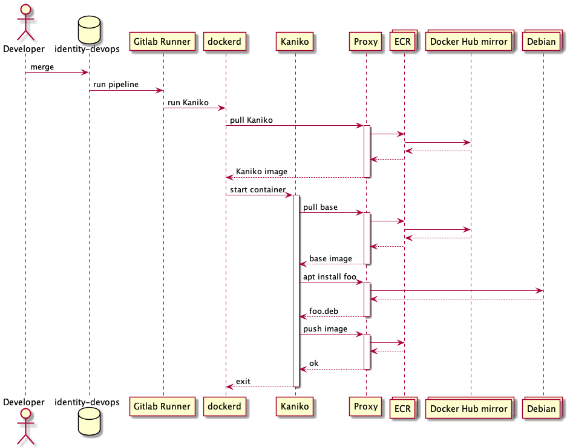

# Architecture!

## IDP

The IDP is a normal rails app running on ec2.  There are diagrams in the SSP.

## Gitlab

Gitlab is a new component that we are working on bringing into our infrastructure to
provide CI/CD and infrastructure automation for us.

It is a standalone rails app that runs on ec2 hosts.  It will be used to generate
artifacts which will be deployed to our various environments.  This is our first stab
at documenting how it is laid out.

## Artifact Build Pipeline

