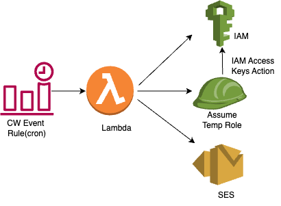

# config_access_key_rotation
This module monitors the IAM User's Access keys. It performs the following:

- Inactivate the access keys if it has not been rotated in the last 90days or if its age is beyond 100days 
- Sends a notification via email using SES, when the password age is between 80 and 90 days
- This implementation does not delete the access  keys for user, thus for access keys with age older than 90days are all made inactive. However, with a slight modification to lambda, we should be able to delete the access keys that are older than 100 days(future implementation).

## Architecture Diagram: IAM Access Key Rotation Diagram

## AWS Resources 
It creates the following AWS Resources:
1. [AWS Lambda](https://docs.aws.amazon.com/lambda/latest/dg/welcome.html) with runtime "python3.9", with an IAM role with limited permissions to Cloudwatch Logs, SNS, Support.
2. [AWS Systems Manager Documents](https://docs.aws.amazon.com/systems-manager/latest/userguide/sysman-ssm-docs.html)
3. [AWS Config Rules](https://docs.aws.amazon.com/config/latest/developerguide/evaluate-config.html)

## Workflow
- AWS Config rule monitors the rotation period for access keys belonging to the IAM users. Any users with access keys not rotated in the past 90days is marked as non_compliant.
- Config rule has a remediation action to make use of AWS systems manager document which notifies  a sns topic of the non_complaint users.
- Lambda is triggered by the above sns topic
- Lambda once getting the non_compliant user name, it checks the access keys associated with the user. Evaluates the active access keys to see if the user has to be notified about the rotation or takes no action is the access keys are still new. 
- Lambda sends an email to the user once the keys are made inactive.
