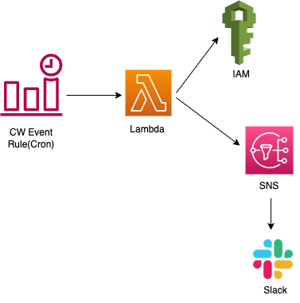

# config_iam_password_rotation
This module monitors the IAM User's password used for Console Login. It performs the following for the users with Console Access enabled:
- Disables console login if the user has never logged in to the Console or not in the past 120 days(with active password)
- Sends a notification to the sns topic, when the password age is between 90 and 100 days
- Disables the console login for users with password age more than 100 days(with active login activity)

## Architecture Diagram: IAM Password Rotation Diagram

## AWS Resources 
It creates the following AWS Resources:
 1. [AWS Lambda](https://docs.aws.amazon.com/lambda/latest/dg/welcome.html) with runtime "python3.9", with an IAM role with limited permissions to Cloudwatch Logs, SNS, Support.
2. [Event Rule](https://docs.aws.amazon.com/AmazonCloudWatch/latest/events/Create-CloudWatch-Events-Rule.html)

## Workflow
- Lambda is triggered by the Cloudwatch event rule at specific time of the day.
- Lambda generates the IAM Credential report and calculates the IAM user's password age and the last time it was used to login. Currently, lambda is configured to disable console login if the user has never logged in or in more than 120 days(with console login being enabled). Also, for users with active login activity, the console login is disabled if password age is more than 100days. Users are notified everyday from 90th-100th day to rotate their password. 
- Lambda is configured to push notification after the console access is disabled as well.