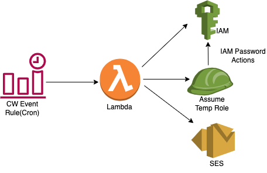

# config_iam_password_rotation
This module monitors the IAM User's password used for Console Login. It performs the following for the users with Console Access enabled:
- Disables console login if the user has never logged in to the Console or not in the past 120 days(with active password)
- Sends a notification to the specific user via email using SES identity email address(noreply@humans.login.gov), when the password age is between 90 and 100 days
- Disables the console login for users with password age more than 100 days(with active login activity) and sends email to the user.

## Architecture Diagram: IAM Password Rotation Diagram

## AWS Resources 
It creates the following AWS Resources:
 1. [AWS Lambda](https://docs.aws.amazon.com/lambda/latest/dg/welcome.html) with runtime "python3.9", with an IAM role with limited permissions to Cloudwatch Logs, SES, IAM.
2. [Event Rule](https://docs.aws.amazon.com/AmazonCloudWatch/latest/events/Create-CloudWatch-Events-Rule.html)

## Workflow
- Lambda is triggered by the Cloudwatch event rule at specific time of the day
- Lambda generates the IAM Credential report and calculates the IAM user's password age and the last time it was used to login
- Currently, lambda is configured to disable console login:
   - If the user has not logged in for more than 120 days(with console login being enabled)
   - Or if password age is more than 100days for users with active login activity
- As of now, users that have never logged in to AWS console are not processed, as they could be users that are still on their onboarding phase
- Users are notified everyday from 90th-100th day to rotate their password via email with sender email address as "noreply@humans.login.gov"
- Further, Lambda is configured to send notification email after the console access is disabled as well
- Lambda when disabling the users' console access, will run the api "iam:DeleteLoginProfile". For this specific action it will use a temporary role with ability to delete login profile just for that specific user. While assuming the temporary role, lambda should only have permissions that is overlap of the temporary role and the  policy it uses during assuming this role.