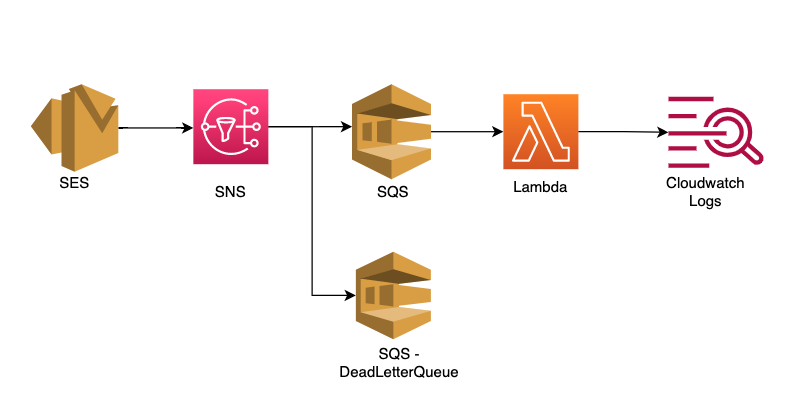

## Overview:

This module enables the feedback notification for the SES verified identity(Domain/Email) to a SNS topic. Feedback notifications for Bounce, Complaint and Delivery will be sent to their respective SNS topic. SQS queue is subscribed to the created SNS topics. A dead letter queue for this SQS queue is created for delivering any failed messages, with retention of 14 days. Lambda is setup with SQS as trigger and masks the receipent's email address before pushing to cloudwatch log group.

## Architecture Diagram: SES Feedback Notification Evaluation POC




## AWS Resources
It creates the following AWS Resources:
1. [AWS Lambda](https://docs.aws.amazon.com/lambda/latest/dg/welcome.html) with runtime "python3.9", with an IAM role with limited permissions to Cloudwatch Logs, Support.
2. [SQS](https://docs.aws.amazon.com/AWSSimpleQueueService/latest/SQSDeveloperGuide/welcome.html)
3. [Cloudwatch Logs](https://docs.aws.amazon.com/AmazonCloudWatch/latest/logs/WhatIsCloudWatchLogs.html)
4. [SNS](https://docs.aws.amazon.com/sns/latest/dg/welcome.html)

## Usage:

```hcl
    module "ses_feedback_notification" {
      source = "../modules/eval_ses_feedback_notification"
      ses_verified_identity = var.ses_verified_identity
    }
```