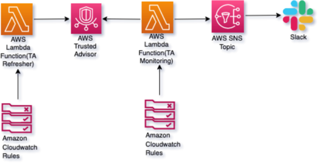

# `monitor_svc_limit`

This module sends a notification to an existing SNS topic when the usage for services supported by [AWS Trusted Advisor](https://aws.amazon.com/premiumsupport/ta-iam/)
is above 80% of allocated quota for the given AWS account.

It creates Lambda functions (using the `python3.9` runtime) along with IAM roles and permissions to access AWS services, CloudWatch and Support.
One Lambda function is responsible for running the `describe_trusted_advisor_checks` API in `us-east-1`,
the other for checking the refresher status and looking for services that have the usage status as **Yellow** or **Red** (notifying an SNS topic with any results it finds).

***NOTE:***
- API calls from within the Lambda are run in the `us-east-1` region, as Trusted Advisor is a global service.
- The ARN of an SNS topic for sending notifications -- created *outside* of this module -- is required for the TA Monitor function.

## Prerequistes
1) SNS topic to send notification

## AWS Resources
It creates the following AWS Resources:
1. [AWS Lambda](https://docs.aws.amazon.com/lambda/latest/dg/welcome.html) with runtime "python3.9", with an IAM role with limited permissions to Cloudwatch Logs, Support.
2. [CW Events Rule](https://docs.aws.amazon.com/AmazonCloudWatch/latest/events/Create-CloudWatch-Events-Rule.html)

## Architecture Diagram: Service Limit Monitoring Diagram


   
## Usage:

```hcl
    module "limit_check_lambda" {
      source = "../modules/monitor_svc_limit"
    
      refresher_schedule = "cron(02 14 * * ? *)"
      monitor_schedule   = "cron(03 14 * * ? *)"
      sns_topic          = [aws_sns_topic.alarm_topic]
    }
```

## Variables

| Name                           | Description                                                       | Type   | Default                            | Required |
| ------------------------------ | ----------------------------------------------------------------- | ------ | ---------------------------------- | -------- |
| **`function_input`**           | JSON input that will be sent to Lambda function                   | json   | `{ "action": "refesh&monitorTA" }` | No       |
| **`lambda_timeout`**           | Timeout Value for Lambda                                          | number | 180                                | No       |
| **`monitor_schedule`**         | Frequency of invoking TA Monitor Lambda from CW event rule        | string | cron(10 14 * * ? *)                | Yes      |
| **`refresher_schedule`**       | Frequency of invoking TA Refresher Lambda from CW event rule      | string | cron(0 14 * * ? *)                 | Yes      |
| **`sns_topic`**                | SNS topic to notify when Service Usage is >80% of allocated limit | string | (N/A)                              | Yes      |
| **`refresher_lambda`**         | Name for TA Refresher function                                    | string | `trustedadvisor-check-refresher`   | No       |
| **`monitor_lambda`**           | Name for TA Monitor function                                      | string | `trustedadvisor-check-monitor`     | No       |

## Outputs

| Name                          | Description                  |
| ----------------------------- | ---------------------------- |
| **`ta_refresher_lambda_arn`** | ARN of TA Refresher function |
| **`ta_monitor_lambda_arn`**   | ARN of TA Monitor function   |
