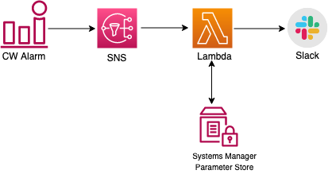

## Overview
This uses the module https://github.com/18F/identity-terraform/tree/main/slack_lambda to create the lambda and its associated resources. Apart from this, a cloudwatch alarm is created that monitors the MaximumUsedTransactionIDs metrics of the database and publishes to SNS topic(subscribed by lambda) whenever alarm fires. For sending notification to additional users/endpoints, enter the arn of existing sns topic to the variable "alarm_actions".

## Workflow

	
