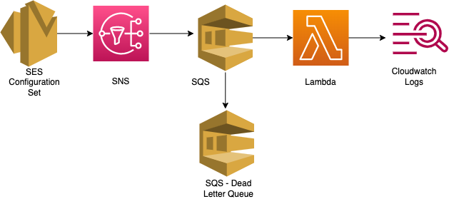

## Overview:

This module allows to capture event data that Amazon SES publishes to Amazon SNS and push the logs to Cloudwatch Logs after removing username from destination email address using configuration sets for SES. The created configuration set captures the event type(Hard bounces, Clicks, Complaints, Deliveries, Opens, Rejects, Rendering failures, Sends) and publishes it to a SNS topic, that it creates. SQS queue is subscribed to the created SNS topic. A dead letter queue for this SQS queue is created for delivering any failed messages, with retention of 14 days. Lambda is setup with SQS as trigger and masks the receipent's email address before pushing to cloudwatch log group.

## Architecture Diagram: SES Feedback Notification Evaluation POC




## AWS Resources
It creates the following AWS Resources:
1. [AWS Lambda](https://docs.aws.amazon.com/lambda/latest/dg/welcome.html) with runtime "python3.9", with an IAM role with limited permissions to Cloudwatch Logs, Support.
2. [SQS](https://docs.aws.amazon.com/AWSSimpleQueueService/latest/SQSDeveloperGuide/welcome.html)
3. [Cloudwatch Logs](https://docs.aws.amazon.com/AmazonCloudWatch/latest/logs/WhatIsCloudWatchLogs.html)
4. [SNS](https://docs.aws.amazon.com/sns/latest/dg/welcome.html)
5. [Configsets](https://docs.aws.amazon.com/ses/latest/dg/creating-configuration-sets.html)

## Usage:

```hcl
    module "ses_events_evaluation" {
                source                = "..//ses-all-events/"
                ses_events_lambda     = var.ses_events_lambda
                ses_events_queue      = var.ses_events_queue
                ses_events_dlq        = var.ses_events_dlq
                ses_verified_identity = var.ses_verified_identity
                region                = var.region
            }
```