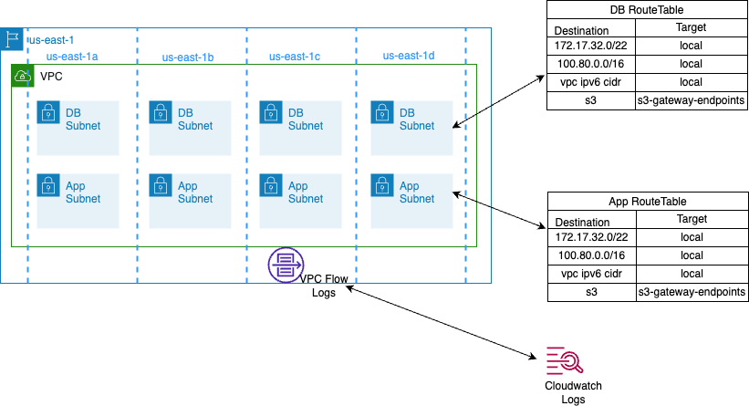

# vpc_module
This module performs the following:

- Creates a vpc when network_us_east_1 flag set to true. To leave out the legacy space and avoid polluting another block of private address space that could prevent future peering, the module is using ip address range 172.17.32.0/22 for us-east-1. It is recommended to use a similar non overlapping range from 172.16/12 prefix for other regions as well. While passing the primary CIDR to new VPC and if this vpc is intended to use for vpc peering please ensure the following, more info [here](https://docs.aws.amazon.com/vpc/latest/peering/vpc-peering-basics.html): 

        - You cannot create a VPC peering connection between VPCs that have matching or overlapping IPv4 
        CIDR blocks.

        - You cannot create a VPC peering connection between VPCs that have matching or overlapping IPv6 
        CIDR blocks.

        - If you have multiple IPv4 CIDR blocks, you can't create a VPC peering connection if any of the 
        CIDR blocks overlap, even if you intend to use only the non-overlapping CIDR blocks or only IPv6 
        CIDR blocks.

- A secondary CIDR calculated from network_layout module can be passed when calling this module, that will associate a secondary cidr to the new or existing vpc.

- Module at the current setup is creating vpc resources for data-services and app subnets. Following resources are created:
        - Database/App Subnets with CIDR calculated from network_layout module can be passed when calling this module
        - Separate Route table, Network Acls is associated with these subnets(not default)
        - A Security Group along with default null security group is created
        - VPC flow log is created with destination as cloudwatch logs

## Architecture Diagram:


## Usage
```

locals {
  network_layout  = module.network_layout.network_layout
}

module "network_layout" {
    source = "../identity-devops/terraform/modules/network_layout"
  }

module "network_us_east_1" {
    count = var.enable_us_east_1_vpc ? 1 : 0
    providers = {
          aws = aws.use1
        }
    source                     = "../modules/vpc_module"
    vpc_cidr_block             = var.us_east_1_vpc_cidr_block
    region                     = "us-east-1"
    secondary_cidr_block       = local.network_layout["us-east-1"][var.env_type]._network
    az                         = local.network_layout["us-east-1"][var.env_type]._zones
    env_name                   = var.env_name
    env_type                   = var.env_type
    enable_data_services       = "true"
    enable_app                 = "true"
    flow_log_iam_role_arn      = module.application_iam_roles.flow_role_iam_role_arn
    db_inbound_acl_rules       = var.db_inbound_acl_rules
    db_outbound_acl_rules      = var.db_outbound_acl_rules
    db_security_group_ingress  = var.db_security_group_ingress
    db_security_group_egress   = var.db_security_group_egress
}

```