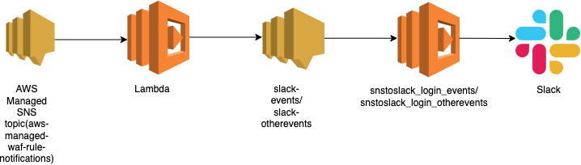

# `waf-mrg-updates`

This module sends early notification to an existing SNS topic of upcoming updates to AWS managed WAF rule groups. Lambda is subscribed to AWS managed SNS topic, which allows us to be notified when the managed rule group provider stages updates. This triggers the existing SNS topic in our accounts that are responsible for sending message to slack channels: login-events and login-otherevents

It creates Lambda functions (using the `python3.9` runtime) along with IAM roles and permissions to access CloudWatch and SNS.

## AWS Resources
It creates the following AWS Resources:
1. [AWS Lambda](https://docs.aws.amazon.com/lambda/latest/dg/welcome.html) with runtime "python3.9", with an IAM role with limited permissions to Cloudwatch Logs, SNS.
2. [IAM Role](https://docs.aws.amazon.com/IAM/latest/UserGuide/id_roles_create_for-service.html)

## Architecture Diagram: waf-mrg-update-notification Diagram

