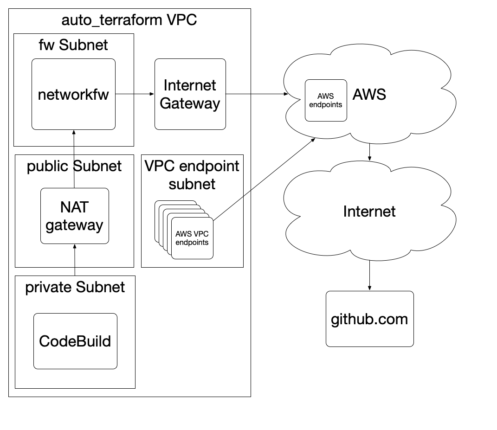

# Auto-Terraform

This directory contains the code that sets up the global stuff that all pipelines need
in `module`, and then calls `module-pipeline` with arguments for each tf dir you want
to build.

Codebuild notices changes in the branch you specify and thus will deploy that tf dir to whatever
env in the account you have specified.  You can go look at the pipelines in the tooling account
to see how they are doing.

The terraform stuff runs using a [terraform bundle](https://github.com/hashicorp/terraform/tree/master/tools/terraform-bundle)
so that we are using tooling that we have specified, and not something dynamically downloaded.
You can update this bundle by editing `bin/terraform-bundle` to update versions of plugins and tf
and then running `aws-vault exec tooling-admin -- bin/terraform-bundle.sh`,
which will upload the new bundle to the tooling auto-tf bucket.  The terraform stuff is only allowed
to access `github.com`, in an attempt to make this system really locked down,
since it will be the lever that can move anything in the login.gov system.

It also requires `iam_auto_terraform_enabled` to not be disabled in the account(s) you
are deploying to.  Right now, `terraform/all/prod/main.tf` and `terraform/all/sms-prod/main.tf`
are disabled, so we cannot to auto-terraform into those accounts until we get permission
to bring auto-terraform into our ATO boundary.

## Security aspects you should think about when changing stuff here

The IAM permissions for the role that is assumed when running terraform can be found
in `terraform/all/module/iam-role-terraform.tf`.  The role that contains the
permissions for the codepipeline and codebuild role can be found in
`terraform/tooling/module/codebuild.tf`.  These powers are pretty extensive already,
but try to not expand them unless you need it.

Since Terraform requires a lot of AWS endpoints, we did as many as possible as VPC
endpoints that live in the public subnet in the auto-terraform VPC.  But not all
AWS services can be put in VPC endpoints, so we had to plug in a Network Firewall
too.  This network firewall limits us to accessing `github.com` and `*.amazonaws.com`
domains.  This list can be expanded if we need to, but try not to do this.  This is
another reason why we like terratest:  we can vendor all the go packages locally
so that we don't need to download them dynamically.  This system is going to be 
deploying important stuff, and the more we can vendor dependencies and limit
external access to prevent supply chain attacks, the better.

## Issues

* Some endpoints cannot be turned into VPC endpoints.  Grr.  So we set up
  a Network Firewall for them.
* If the build fails because it takes too long or you stop the build,
  it just kills everything immediately rather than gracefully letting terraform
  unlock itself.  So if a build takes too long, you may need to unlock
  it by hand in dynamo.
* CodePipeline is kind of dumb.  You cannot decline to continue if there
  are no changes in a terraform plan or whatever, or have any conditional
  action at all.  Even stopping the pipeline from within the codebuild job
  will result in a failed pipeline run and generate an alert.  Grr.
